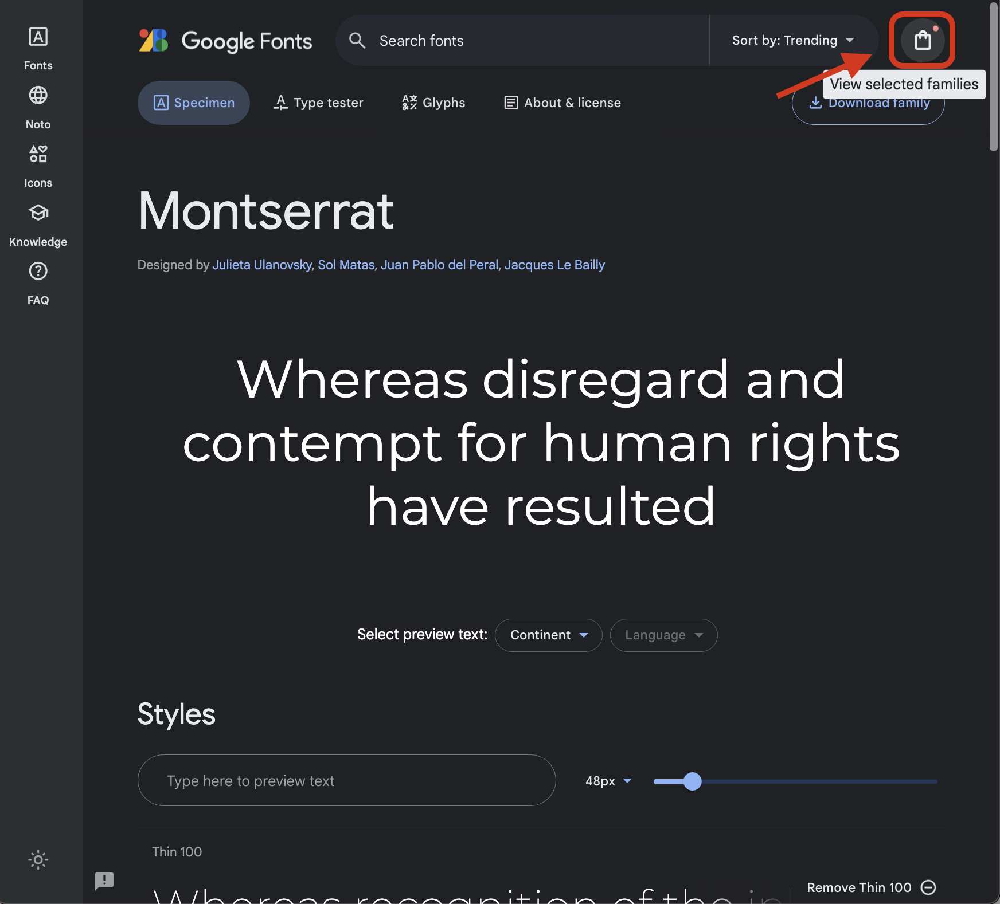

<h1>
  <span class="headline">Intermediate CSS</span>
  <span class="subhead">Fonts</span>
</h1>

**Learning objective:** By the end of this lesson, students will understand how to choose and implement fonts in web development, including the use of system fonts and importing fonts from Google Fonts.

## System fonts

When choosing a font for our projects, we can use a pre-installed system font, a web-safe font, or import a font from a library like Google Fonts.

System fonts are a good option because they are guaranteed to be available on all users' devices. By specifying this font name, we guarantee that a font native to the operating system is being used.

To use a system font in CSS, we specify a special font name (`system-ui`) in the [`font-family`](https://developer.mozilla.org/en-US/docs/Web/CSS/font-family) property.

```css
body {
  font-family: system-ui, sans-serif;
}
```

And here's the result:


Image from [system-fonts on GitHub](https://github.com/system-fonts/modern-font-stacks).

By specifying a fallback font, such as `sans-serif`, we ensure that our text will still be readable even if the requested font isn't available.

## Google Fonts

[Google Fonts](https://fonts.google.com/) are a great option if we want to use a font that is not pre-installed on the user's device. Google Fonts are free to use and have a wide variety of fonts to choose from, including serif, sans-serif, display, and handwriting fonts.

Navigate to [https://fonts.google.com/](https://fonts.google.com/) and choose the font(s) you want.

Once on the page for a specific font, select the font variations you want to use on your site (if there are multiple).


If a sidebar doesn't automatically open after selecting a font variation, open it by clicking on the **shopping bag** icon in the top right:



Next, choose `@inport`:


Copy the text ***excluding*** the opening and closing `<style>` tags. Paste it above the rest of the code in your CSS file, as shown here:

```css
@import url('https://fonts.googleapis.com/css2?family=Montserrat:wght@100&display=swap')

* {
  box-sizing: border-box;
}

body {
  font-family: Helvetica, Tahoma, Verdana, sans-serif;
}

h1 {
  text-align: center;
}
```

Keep in mind that if you decide to add more Google fonts to your project, you'll need to update this link.

### Apply your new font

After linking or importing your new font, apply it to either the entire HTML page by updating the `font-family` property in the body or to specific text elements by modifying their `font-family` property individually.

```css
body {
  font-family: 'Montserrat', sans-serif;
}
```

Check out the lesson on `Web-safe Fonts` for more details on other fonts that are safe to use in web development.
