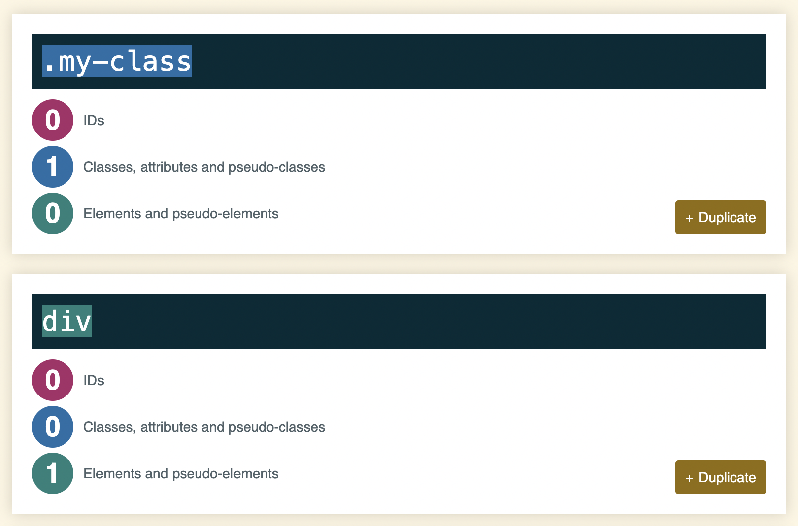

<h1>
  <span class="headline">Intermediate CSS</span>
  <span class="subhead">Specificity</span>
</h1>

**Learning objective:** By the end of this lesson, learners will be able to explain the concept of CSS specificity, determine the specificity of different selectors, and resolve conflicts in CSS rules to predict and ensure the intended styling outcome.

Specificity is a way the browser decides which CSS rule gets applied when there is a conflict. For example:

```css
.my-class {
    color: blue;
}

div {
    color: red;
}

<div class="my-class">What color am I?</div>
```

A conflict exists because the same `<div>` has two CSS selectors applied with a color.

The selector with the highest *specificity* wins.

Specificity is based upon the following priorities, where priority A has the highest specificity and priority D has the lowest specificity:

- Priority A: inline styling
- Priority B: IDs
- Priority C: Classes, attributes, & pseudo-classes
- Priority D: Elements

So, in the above example, we'd expect the `div` to be blue, as classes take have a higher specificity than elements.

Internally, the browser computes specificity, as shown below.



source: [Keegan Street - Specificity Calculator](https://specificity.keegan.st/)
