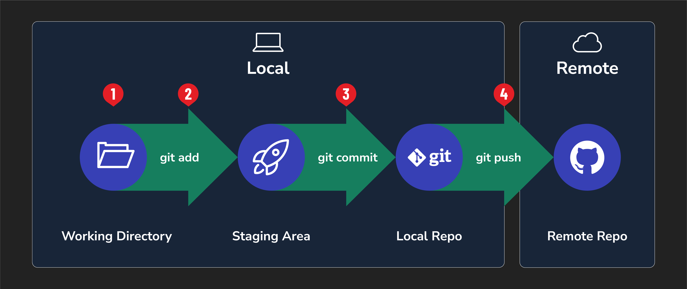

<h1>
  <span class="headline">Intro to Git and GitHub</span>
  <span class="subhead">Git Flow</span>
</h1>

**Learning objective:** By the end of this lesson, students will be able to execute and explain the four key steps of the Git flow—`write`, `stage`, `commit`, and `push`—for effective version control and code collaboration.

## Understanding the Git flow

Adding Git to an existing workflow takes just a few commands in the terminal. Here are the steps:

1. Write code
2. Stage work
3. Commit staged work
4. Push committed work

Here's a graphic that sums this up:



Let's walk through how to carry out these individual steps. Along the way, we'll use a rocket's payload as an analogy.

## 1. Write code

Write code just as you always would! Nothing about this step changes by adding Git to your workflow.

Just like the payload on a rocket needs to be thought out and built before it can be added to the rocket's payload, you'll do the same with your code!

## 2. Stage (add)

After making changes to your code, use this command to stage those changes:

```bash
git add -A
```

> 🧠 The `-A` in `git add -A` means to include all of the files in the current Git repo.

### What it does

This command adds all files/folders in the current directory to a staging area, where they will be added to the next commit.

### When and why we use it

Use this command after making changes to your code that you want to potentially commit to the local repository. To track file changes, you must add them to the staging area.

The staging area is an intermediate area where changes to files are stored before being committed to the repository.

The `-A` flag in `git add -A` will add all of the files in the repo that we are currently working with. We are also able to add one file at a time, or multiples, by writing the file names out when we add:

```bash
git add index.html
```

When doing collaborative coding, it will become clearer why not adding every single file at once can be beneficial. For now, `git add -A` will work great!

Continuing the rocket analogy, running the `git add -A` command puts the payload next to the rocket to be loaded. Nothing is finalized yet; changes could still be made, but preparations are happening.

## 3. Commit

The command:

```bash
git commit -m "commit message"
```

### What it does

This command allows you to provide a checkpoint where you can save the recent changes you've made to your code. It also allows you to enter a message describing the changes made to your code for future reference.

Commit messages should should describe the changes that the code is making. For example, if a commit fixes a typo in your code, the commit message should be "fix typo". Stay away from messages like "stuff" or "fix".

### When and why we use it

Use this command after adding changes to the staging area to commit those changes. Commits provide a list detailing changes that have been made to your code. This allows you (or anyone viewing your repository) to see the changes to code made over time. It also allows you to revert to previous versions of your code if you break something and can't figure out how to fix it.

Committing your code is putting the payload onto the rocket to be launched. Whenever the rocket takes off, it will carry the committed code.

## 4. Push

The command:

```bash
git push <remote-name> <remote-branch-name>
```

Typically when not working collaboratively, `<remote-name>` will be `origin`, and `<remote-branch-name>` will be `main`. Therefore, you will typically run:

```bash
git push origin main
```

### What it does

This command sends all the committed changes to a remote repository.

### When and why we use it

Do this after you `git add -A` and `git commit -m "Your commit message"`. This will get your code up to GitHub from your own computer. You push it from a local repository up to a repository hosted by GitHub.

Finalizing the rocket analogy 🚀 - pushing your code is like launching the rocket and sending its payload to planet GitHub for all to see!

## Why is Git flow important?

When working alone, it may be difficult to see the benefits of Git at first. Here are some benefits you get immediately even if you're not collaborating with others:

- This workflow encourages small incremental changes. Making smaller changes makes it easier to understand the differences between each version and lets us hone in on those individual changes.
- Each commit should make it clear what was done and why.
- You are creating a backup for your code by pushing it to GitHub. If local changes are corrupted or the machine fails, the code that you've written is safe on GitHub.
- Reverting to a previous state in the code is easier. Commits create a history you can revert to at any time.

There are even more benefits when you start collaborating with code.

> ♻️ Repeatable Pattern: when working alone, the typical Git workflow will be:
>
> ***Make changes to your code***
>
> ```bash
> git add -A
> git commit -m "message describing code changes"
> git push origin main
> ```
>
> ***Repeat***
>
> You will almost always run these three commands together.
