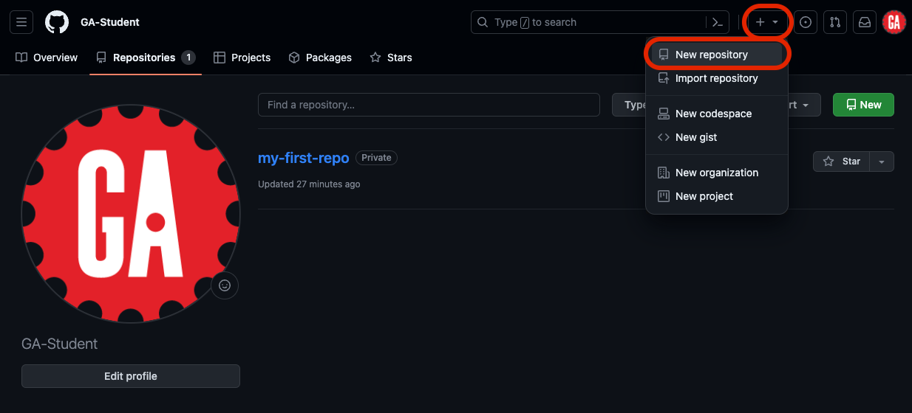
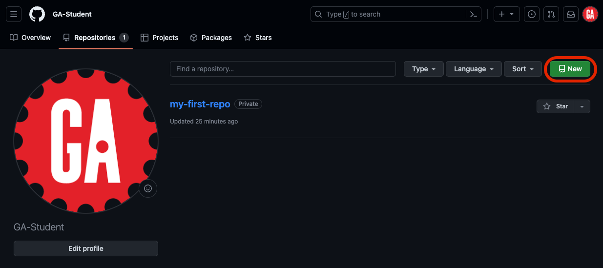
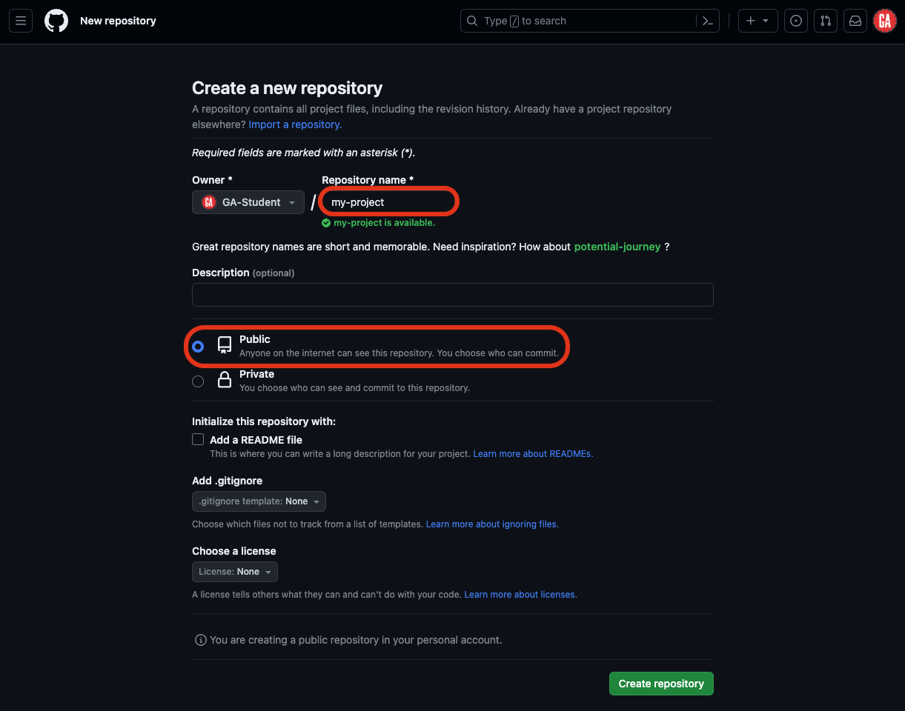
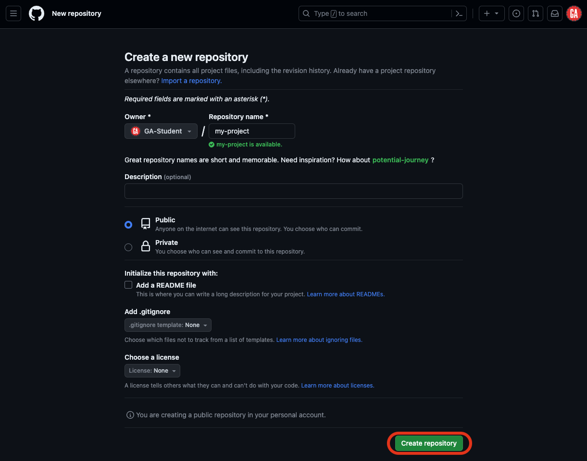
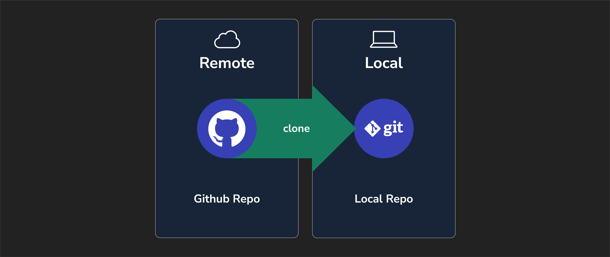

<h1>
  <span class="headline">Intro to Git and GitHub</span>
  <span class="subhead">GitHub Fundamentals</span>
</h1>

**Learning objective:** By the end of this lesson, students will be able to create and clone a GitHub repository and open it in VS Code.

## Creating a repository

Here are the steps to creating a new repository on GitHub:

There are two primary ways to get to the new repository page. You can use the dropdown menu from the main nav bar:



If you're on your GitHub profile page, you can alternatively click on the repositories tab and select the **New** button:

> ⚠ If you have never made a repository, you will not have a repository tab yet!



Be sure that you select an appropriate name for the repository. Many organizations use lower-kebab-case for their repo names, but there are no strict rules for repo names, except they must only contain [ASCII](https://en.wikipedia.org/wiki/ASCII) letters, digits, and the characters `.`, `-`, and `_`.

If you plan on sharing it with others (for example, if you're creating something you will eventually submit as a deliverable), be sure that it is public:



Be sure that NONE of the following options are selected:


There's a time and place to use these options; hold off while you're learning the ropes!

When you've entered these items, click the **Create repository** button:



You now have a remote repository on GitHub!

## Cloning a repository



Cloning allows us to take the current version of a project from a remote repository on GitHub and copy it into a local repository on your computer.

You'll follow these steps any time you want to make a copy of a project that already exists on GitHub.

### Step 1

Navigate to the parent directory where you want the cloned directory to exist:

```bash
cd ~/code/ga/lectures
```

### Step 2

Using the URL from GitHub, clone the repository:

```bash
git clone https://github.com/<original-author>/my-project.git
```

Do not copy the above command. It will not work. Your username will replace `<original-author>` in the URL above.  Also make sure `my-project.git` matches the name that you gave the repo when you were creating it

> 🧠 When you clone a repository, a directory matching the repository's name on GitHub will be created automatically.
>
> For example, when we clone the `my-project` repo, all the files in that repo will be copied into a new `my-project` directory. This directory will be in our `~/code/ga/lectures` directory.

### Step 3

Navigate into the new directory and open it in VS Code:

```bash
cd my-project
code . 
```

> 🧠 When you clone a repository, an origin remote will automatically be set using the URL you used to clone it. You can confirm this with the `git remote -v` command. If you've cloned a repository that you don't own (or have write access to), you won't be able to push changes!
