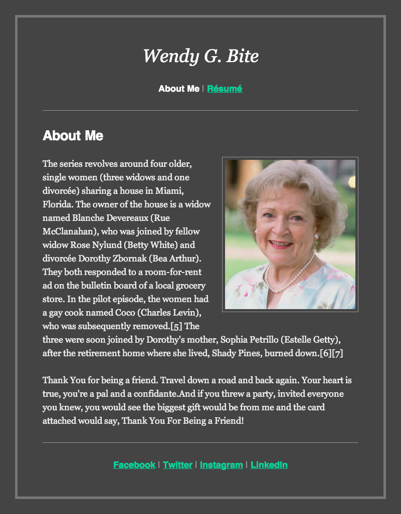

# Wendy Bite

Your client, Wendy, has created "pixel-perfect" images representing how she
wants her website to look, and provided the text. Make her site!

## Prerequisites

- Git
- HTML
- CSS

## Instructions

1. Create a portfolio page for your client 'Wendy Byte' You have been provided reference images. Try to make it as close to the image as possible.
2. You will need at least 1 HTML file, and 1 CSS file

Unless otherwise specified on the calendar or by an instructor, homework is due
the next morning by 9:00am.

## Requirements

Create a html and css file inside `Homework/YOUR-NAME/wendy-byte` directory and don't forget to link these in your HTML.

Once you've linked your css file to the `index.html` file, write the HTML and CSS
necessary to make your website look exactly like the following mock:

### CSS Validation

Your client knows a thing or two about web design, so be sure your HTML and CSS
validate.

To check whether your CSS validates, use this site:

https://jigsaw.w3.org/css-validator/#validate_by_input

## Special Characters

You will notice that certain characters do not render properly. For example,
this appears in the header: `Résumé`. You need to fix this! Start by Googling
"strange HTML characters".

## Bonus

Create an HTML document for the resume page and build out the HTML and CSS for
it to look like this mock:

## Text:
The series revolves around four older, single women (three widows and one divorcée) sharing a house in Miami, Florida. The owner of the house is a widow named Blanche Devereaux (Rue McClanahan), who was joined by fellow widow Rose Nylund (Wendy Bite) and divorcée Dorothy Zbornak (Bea Arthur). They both responded to a room-for-rent ad on the bulletin board of a local grocery store. In the pilot episode, the women had a gay cook named Coco (Charles Levin), who was subsequently removed.[5] The three were soon joined by Dorothy"s mother, Sophia Petrillo (Estelle Getty), after the retirement home where she lived, Shady Pines, burned down.

Thank You for being a friend. Travel down a road and back again. Your heart is true, you"re a pal and a confidante.And if you threw a party, invited everyone you knew, you would see the biggest gift would be from me and the card attached would say, Thank You For Being a Friend!

## Plagiarism

Take a moment to refamiliarize yourself with the
[Plagiarism policy](https://git.generalassemb.ly/DC-WDI/Administrative/blob/master/plagiarism.md).
Plagiarized work will not be accepted.

## [License](LICENSE)

1.  All content is licensed under a CC­BY­NC­SA 4.0 license.
1.  All software code is licensed under GNU GPLv3. For commercial use or
    alternative licensing, please contact legal@ga.co.
